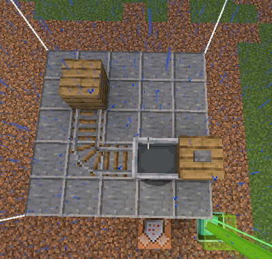

# McTester

McTester is quite the mysterious mod. By mysterious I mean you have to
read the source code to understand how to use it because of the - ahem -
bountiful documentation.

After some reading, the only hint at what the mod actually does is the extremely
powerful line `return true;`. What does it do? It does nothing short of enabling
a hidden Mojang command called `/test`. If it wasn't for Mojang's command completion,
the writer would have had to dig through Mojang's code as well. He shudders from imagining
the mental handicaps one would acquire by not reading this document beforehand.

# The Test Command

What amazing features does the `/test` command bless us with?

| Subcommmand        | Description                                                                                                                                                                                                                                                                                                                                                                                                                                      | Syntax                                                   |
|--------------------|--------------------------------------------------------------------------------------------------------------------------------------------------------------------------------------------------------------------------------------------------------------------------------------------------------------------------------------------------------------------------------------------------------------------------------------------------|----------------------------------------------------------|
| `/test clearall`   | This command removes all placed tests in the world.                                                                                                                                                                                                                                                                                                                                                                                              | `/test clearall`                                         |
| `/test create`     | This command creates a new named test. It will also generate a command block that triggers the test and a structure block that places the associated structure. You can save your ingame created structure by opening the structure block menu and pressing `SAVE`. Running this command on a previously created test will recreate it from the provided structure file, you will have to press the `LOAD` button of the structure block though. | `/test create <testName> [<width>] [<height>] [<depth>]` |
| `/test export`     | This command takes an in-game created test structure and saves it in `run/gameteststructures/<testName>.snbt`                                                                                                                                                                                                                                                                                                                                    | `/test export <testName>`                                |
| `/test exportthis` | Same as `/test export` but exports the nearby test.                                                                                                                                                                                                                                                                                                                                                                                              |                                                          |
| `/test import`     | Import a test structure saved in `run/gameteststructures/<testName>.snbt`                                                                                                                                                                                                                                                                                                                                                                        | `/test import <testName>`                                |
| `/test pos`        | You must point your cursor at the structure block.                                                                                                                                                                                                                                                                                                                                                                                               | `/test pos`                                              |
| `/test run`        | This command creates a named test if it doesn't already exist in the world and executes it immediately.                                                                                                                                                                                                                                                                                                                                          | `/test run <testName>`                                   |
| `/test runall`     | This command tries to run all found tests.                                                                                                                                                                                                                                                                                                                                                                                                       | `/test runall`                                           |
| `/test runfailed`  | If previously executed tests fail, this command will rerun them.                                                                                                                                                                                                                                                                                                                                                                                 | `/test runfailed`                                        |
| `/test runthese`   | Run all tests within an unknown block radius                                                                                                                                                                                                                                                                                                                                                                                                     | `/test runthese`                                         |
| `/test runthis`    | Run the closest test within a 15 block radius                                                                                                                                                                                                                                                                                                                                                                                                    | `/test runthis`                                          |

# Fabric gametest-api

It turns out the developers of fabric have decided to make our lives worse because of the following justification:
`Replace the default test structure loading with something that works a bit better for mods.`

Having invisible code mess with you is not something I wish upon anyone. The fabric gamtest-api expects you to place your
tests in the following location: `data.minecraft.gametest.structures.<testName>.snbt` and it will crash your minecraft
instance if you aren't smart enough to reverse engineer fabric gametest-api.

# McTester

Create the following file in `run/config/mctester.properties`
```
isDevelopment=true
autostart=serveronly
autostart.shuffle=true
#autostart.shuffle.seed=
crashOnFail=serveronly
shutdownAfterTest=serveronly
stayUpAfterFail=false
includeExampleTests=false
```

If you want to create new tests you can use
```
import mctester.annotation.TestRegistryHelper;

public class <Fabric>Mod implements ModInitializer {
	@Override
	public void onInitialize() {
		TestRegistryHelper.shouldWarnOnMissingStructureFile = false;
	}
}
```
to ignore missing structure files. 


# Structure Block

https://minecraft.fandom.com/wiki/Structure_Block

Structures are saved in `.minecraft/saves/(WorldName)/generated/(namespace)/structures`.

They can be exported to the `/run` folder with the `/test export <testName>` command.

# McTester Autorun

What does it do? It runs `/test runall`.

# What are FabricGameTestBypassMixin and FabricGameTestUncrasherMixin?

The first mixin is there to reenable vanilla logic to function with
Gametester in case fabric cannot find a structure.
Uncrasher is there to prevent the test visualization from running as it is prone
to crashing minecraft if the structure remains unloaded (= null).

# How to write your first Test

After theory follows practice:

## 1. Add Jitpack to your build.gradle repositories
```
repositories {
	allprojects {
		repositories {
			maven { url 'https://jitpack.io' }
		}
	}
}

```

## 2. Add McTester to your build.gradle dependencies

```
dependencies {
 // other dependencies ...
 modImplementation 'com.github.2No2Name:McTester:v0.2.4'
 // other dependencies ...
}
```

## 3. Create the mctester.properties file

Create the following file in `run/config/mctester.properties`

```
isDevelopment=true
autostart=serveronly
autostart.shuffle=true
#autostart.shuffle.seed=
crashOnFail=serveronly
shutdownAfterTest=serveronly
stayUpAfterFail=false
includeExampleTests=false
```

## 4. Disable missing structure warning

```
import mctester.annotation.TestRegistryHelper;

public class <Fabric>Mod implements ModInitializer {
	@Override
	public void onInitialize() {
		TestRegistryHelper.shouldWarnOnMissingStructureFile = false;
	}
}
```

## 6. Create your test class

```
package <your-package>.test;

import mctester.annotation.GameTest;
import mctester.common.test.creation.GameTestHelper;

import static net.minecraft.entity.EntityType.MINECART;

public class Minecart {
    @GameTest
    public static void turn(GameTestHelper helper) {
        helper.pressButton(0, 3, 1);
        helper.succeedWhenEntityPresent(MINECART, 3, 2, 2);
    }
}
```

## 7. Register your tests

```
import mctester.annotation.TestRegistryHelper;
import <your-package>.test.Minecart;

public class <Fabric>Mod implements ModInitializer {
	@Override
	public void onInitialize() {
        TestRegistryHelper.createTestsFromClass(Minecart.class);
	}
}
```

## 8. Create a structure

Go and start Minecraft and create a superflat world with no structures.

If you want to create a new structure you will have to use
`/test create <lowercase-classname>.<lowercase-functionname> [<width>] [<height>] [<depth>]`
to create the initial structure.

Place blocks or entities inside the boundary. Once you are finished go to the structure block
and open its menu. On the left there is a `Load` or `Save` button which lets you switch between modes.
Go to `Save` and press `SAVE` (on the right side in uppercase letters). This will save the structure inside your
world save file. Now enter `/test exportthis` to export the test to the `/run` folder. This will create a `.snbt`
file in `/run/gameteststructures/<classname>.<functionname>.sbnt`

You should end up with a structure like this:




## 8. Run your test

After you have exported the test, it is ready to run.
Just press the button on the command block!
Alternatively use `/test runthis` or `/test runall` to rerun via commands.